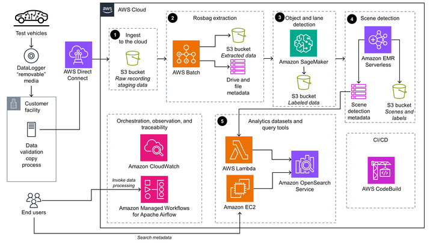

# Scene Intelligence with Rosbag on AWS

Scene Intelligence with Rosbag on AWS - Solution

## Table of contents

## Architecture

The following image shows the architecture of the Scene Intelligence with Rosbag on AWS solution.



### AWS CDK constructs

[AWS Solutions Constructs](https://aws.amazon.com/solutions/constructs/) make it easier to consistently create well-architected applications with [AWS Cloud Development Kit](https://aws.amazon.com/cdk/) (AWS CDK). AWS reviews all AWS Solutions Constructs and uses best practices established by the [AWS Well-Architected Framework](https://aws.amazon.com/architecture/well-architected).

## Deployment

You can launch this solution with one click from the AWS Solutions [landing page](https://aws.amazon.com/solutions/implementations/scene-intelligence-with-rosbag-on-aws).

To customize the solution, or to contribute to the solution, see [Creating a custom build](#creating-a-custom-build)

## Configuration

### Creating a custom build

To customize the solution, complete the steps in the following sections.

#### Prerequisites

The following procedures assume that all the OS-level configuration has been completed. They are:

* [AWS Command Line Interface](https://aws.amazon.com/cli/)
* [Python](https://www.python.org/) 3.9 or newer
* [AWS CDK](https://aws.amazon.com/cdk/) 2.70.0 or newer

***Note: Test the templates before updating production deployments.***

#### 1. Download/clone this repo and checkout the branch of interest

```bash
git clone https://github.com/awslabs/autonomous-driving-data-framework.git
cd autonomous-driving-data-framework/
git checkout scene-intelligence-with-rosbag-on-aws
```

#### 2. Create a Python virtual environment for development

```bash
python -m venv .venv 
source ./.venv/bin/activate 
cd ./source 
pip install -r requirements-dev.txt 
```

#### 3. Customize the solution

See the [customization guide](https://docs.aws.amazon.com/solutions/latest/scene-intelligence-with-rosbag-on-aws/customization-guide.html) available in the implementation guide.

***

Copyright Amazon.com, Inc. or its affiliates. All Rights Reserved.

Licensed under the Apache License, Version 2.0 (the "License");
you may not use this file except in compliance with the License.
You may obtain a copy of the License at

    http://www.apache.org/licenses/LICENSE-2.0

Unless required by applicable law or agreed to in writing, software
distributed under the License is distributed on an "AS IS" BASIS,
WITHOUT WARRANTIES OR CONDITIONS OF ANY KIND, either express or implied.
See the License for the specific language governing permissions and
limitations under the License