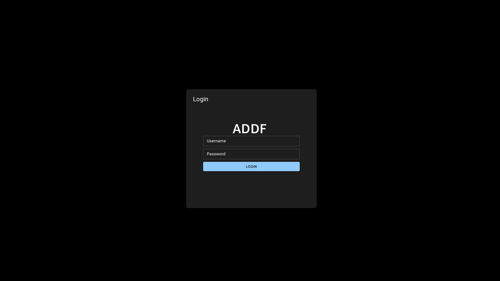
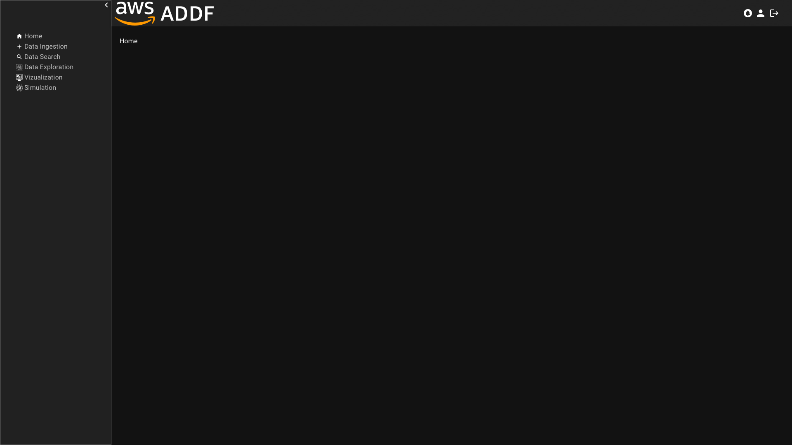
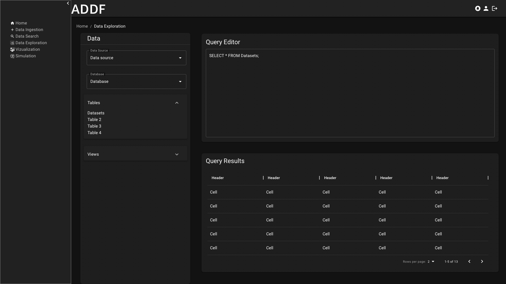

# ADDF WebApplication
## Wireframes

### Features
ADDF WebApplication provides wireframes for the following modules:

- Login
- Homescreen
- Data Ingestion
- Data Search
- Data Exploration
- Data Vizualization with Amazon Quicksight
- Data Vizualization with Foxglove
- Simulation

## Get started

In order to vizualize the Wireframes and underlying assets, you will need [Sketch](https://www.sketch.com/)
For the Wireframes we used the React component library [Material UI (MUI)](https://mui.com/). Same functionality can be achieved with other component library and other Frameworks (e.g. Angular).
Going forward we will publish modules with functionality described in the Wireframes using React and MUI.

## Demo

### Login

### Homescreen

### Data Ingestion

### Data Search

### Data Exploration

### Vizualization - Quicksight

### Vizualization - Foxglove

