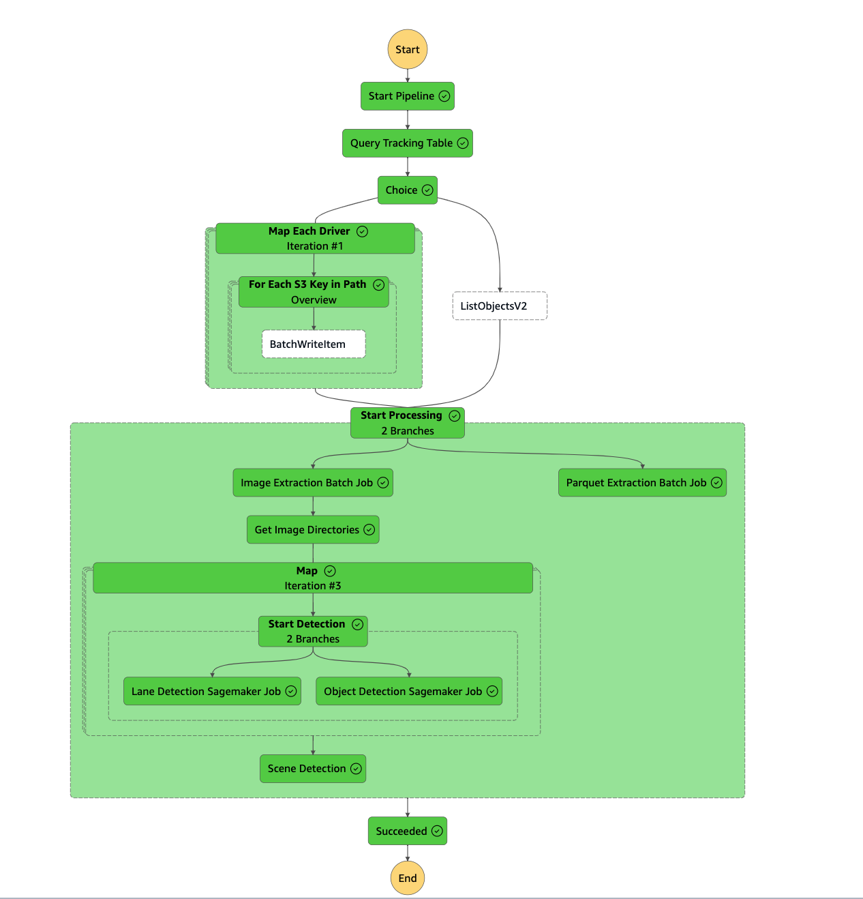

# Ros Image Extraction Pipeline

## Description

This module contains an end-to-end pipeline for extracting images from Rosbag recording files using AWS Batch.
The module labels these extracted images with open-source object detection and lane detection models
using Sagemaker Processing jobs. The entire pipeline is orchestrated with a StepFunction statemachine. 
The pipeline also extracts a given set of topics to parquet files. 
The pipeline expects a config of a list of drives to process from S3.

This module deploys:

- IAM Role for the State Machine
- a DynamoDB table used for passing data to AWS Batch containers and Sagemaker Processing jobs.

The deployspec also includes commands to:
- upload artifacts/ to S3 which includes the script for EMR & and a jar file for using the `spark-dynamodb` package

## State Machine Diagram 


## Testing module

Trigger state machine with a config like:
```json
{
  "drives_to_process": [
    {
      "drive": "test-vehicle-01",
      "bucket": "{S3_BUCKET}",
      "prefix": "{S3_PREFIX}"
    },
    {
      "drive": "test-vehicle-02",
      "bucket": "{S3_BUCKET}",
      "prefix": "{S3_PREFIX_2}"
    }
  ]
}
```

where files exist in:
    s3://{S3_BUCKET}/{S3_PREFIX}/*.bag
    s3://{S3_BUCKET}/{S3_PREFIX_2}/*.bag
    
    
## Inputs/Outputs

### Input Parameters

#### Required

- `parquet-batch-job-def-arn`: arn of the Batch Job Definition for extracting sensor data to parquet files
- `png-batch-job-def-arn`: arn of the Batch Job Definition for extracting image data to png files
- `object-detection-image-uri`: ecr uri of the image for running object detection models
- `object-detection-job-concurrency`: max number of parallel sagemaker processing jobs to trigger
- `object-detection-iam-role`: execution role of the object detection container
- `object-detection-instance-type`: instance type to use for the Sagemaker processing job for object detection
- `lane-detection-image-uri`: ecr uri of the image for running lane detection models
- `lane-detection-job-concurrency`: max number of parallel sagemaker processing jobs to trigger
- `lane-detection-iam-role`: execution role of the lane detection container
- `lane-detection-instance-type`: instance type to use for the Sagemaker processing job for lane detection
- `vpc-id`: The VPC-ID that EMR application will run in
- `private-subnet-ids`: subnets EMR application will run in
- `image-topics`: topics for object detection
- `sensor-topics`: topics for lane detection
- `source-bucket`: Bucket containing the raw recording data
- `intermediate-bucket`: Output bucket for saving images
- `logs-bucket-name`: Bucket for logs
- `artifacts-bucket-name`: Bucket for storing artifacts
- `full-access-policy-arn`: Access policy from Datalake Bucket Core Module
- `on-demand-job-queue-arn`: Job Queue ARN from Batch Compute Core Module
- `spot-job-queue-arn`: Job Queue ARN from Batch Compute Core Module
- `fargate-job-queue-arn`: Job Queue ARN from Batch Compute Core Module
- `emr-app-id`: Application Id of EMR serverless 
- `rosbag-scene-metadata-table`: Dynamo Table to store metadata

#### Optional
- `solution-id`: a unique identifier for this deployment (must be used with `solution-description`)
- `solution-name`: a unique name for this deployment (must be used with `solution-id`)
- `solution-version`: a unique version for this deployment
- `desired-encoding`: default `bgr8`

The parameters `(solution-*)` will resolve a custom text that is used as a description of the stack if populated.
    
### Sample declaration of AWS Batch Compute Configuration

```yaml
name: image-pipeline
path: modules/analysis/rosbag-image-pipeline-sfn
parameters:
  - name: vpc-id
    valueFrom:
      moduleMetadata:
        group: optionals
        name: networking
        key: VpcId
  - name: private-subnet-ids
    valueFrom:
      moduleMetadata:
        group: optionals
        name: networking
        key: PrivateSubnetIds
  - name: image-topics
    value:
      - /flir_adk/rgb_front_left/image_raw
      - /flir_adk/rgb_front_right/image_raw
  - name: sensor-topics
    value:
      - /vehicle/gps/fix
      - /vehicle/gps/time
      - /vehicle/gps/vel
      - /imu_raw
  - name: desired-encoding
    value: bgr8
  - name: lane-detection-job-concurrency
    value: 20
  - name: lane-detection-instance-type
    value: ml.m5.2xlarge
  - name: lane-detection-image-uri
    valueFrom:
      moduleMetadata:
        group: docker-images
        name: lane-detection
        key: ImageUri
  - name: lane-detection-iam-role
    valueFrom:
      moduleMetadata:
        group: docker-images
        name: lane-detection
        key: ExecutionRole
  - name: object-detection-job-concurrency
    value: 30
  - name: object-detection-instance-type
    value: ml.m5.xlarge
  - name: object-detection-image-uri
    valueFrom:
      moduleMetadata:
        group: docker-images
        name: object-detection
        key: ImageUri
  - name: object-detection-iam-role
    valueFrom:
      moduleMetadata:
        group: docker-images
        name: object-detection
        key: ExecutionRole
  - name: parquet-batch-job-def-arn
    valueFrom:
      moduleMetadata:
        group: docker-images
        name: ros-to-parquet
        key: JobDefinitionArn
  - name: png-batch-job-def-arn
    valueFrom:
      moduleMetadata:
        group: docker-images
        name: ros-to-png
        key: JobDefinitionArn
  - name: rosbag-scene-metadata-table
    valueFrom:
      moduleMetadata:
        group: core
        name: metadata-storage
        key: RosbagSceneMetadataTable
  - name: source-bucket
    valueFrom:
      moduleMetadata:
        group: optionals
        name: datalake-buckets
        key: RawBucketName
  - name: intermediate-bucket
    valueFrom:
      moduleMetadata:
        group: optionals
        name: datalake-buckets
        key: IntermediateBucketName
  - name: logs-bucket-name
    valueFrom:
      moduleMetadata:
        group: optionals
        name: datalake-buckets
        key: LogsBucketName
  - name: artifacts-bucket-name
    valueFrom:
      moduleMetadata:
        group: optionals
        name: datalake-buckets
        key: ArtifactsBucketName
  - name: full-access-policy-arn
    valueFrom:
      moduleMetadata:
        group: optionals
        name: datalake-buckets
        key: FullAccessPolicyArn
  - name: on-demand-job-queue-arn
    valueFrom:
      moduleMetadata:
        group: core
        name: batch-compute
        key: OnDemandJobQueueArn
  - name: spot-job-queue-arn
    valueFrom:
      moduleMetadata:
        group: core
        name: batch-compute
        key: SpotJobQueueArn
  - name: fargate-job-queue-arn
    valueFrom:
      moduleMetadata:
        group: core
        name: batch-compute
        key: FargateJobQueueArn
  - name: emr-job-exec-role
    valueFrom:
      moduleMetadata:
        group: core
        name: emr-serverless
        key: EmrJobExecutionRoleArn
  - name: emr-app-id
    valueFrom:
      moduleMetadata:
        group: core
        name: emr-serverless
        key: EmrApplicationId
```

#### Optional

### Module Metadata Outputs

- `SecurityGroupId`: Id of the security group used by the EMR application
- `SfnRoleArn`: ARN of the State Machine Execution Role created by the Stack
- `OnDemandJobQueueArn`: ARN of the ON_DEMAND AWS Batch Queue
- `SpotJobQueueArn`: ARN of the SPOT AWS Batch Queue
- `FargateJobQueueArn`: ARN of the FARGATE AWS Batch Queue
- `EcrRepoName`: ECR Repo of the Container
- `DynamoDbTableName`: Table for orchestrating AWS Batch job
- `DetectionsDynamoDBName`: Table for storing output from metadata collection
- `SourceBucketName`: Bucket containing raw data
- `TargetBucketName`: Bucket to save images and video to
- `LogsBucketName`: Bucket to write logs to
- `ArtifactsBucketName`: Bucket to save artifacts to
- `ParquetBatchJobDefArn`: arn of the Batch Job Definition for extracting sensor data to parquet files
- `PngBatchJobDefArn`: arn of the Batch Job Definition for extracting image data to png files
- `ObjectDetectionImageUri`: ecr uri of the image for running object detection models
- `ObjectDetectionJobConcurrency`: max number of parallel sagemaker processing jobs to trigger
- `ObjectDetectionRole`: execution role of the object detection container
- `ObjectDetectionInstanceType`: instance type to use for the Sagemaker processing job for object detection
- `LaneDetectionImageUri`: ecr uri of the image for running lane detection models
- `LaneDetectionJobConcurrency`: max number of parallel sagemaker processing jobs to trigger
- `LaneDetectionRole`: execution role of the lane detection container
- `LaneDetectionInstanceType`: instance type to use for the Sagemaker processing job for lane detection
- `FileSuffix`: file extension of input files, in most cases this will be `.bag`
- `DesiredEncoding`: encoding format
- `YoloModel`: object detection model version to use
- `ImageTopics`: object detection topics
- `SensorTopics`: scene detection topics

#### Output Example

```json
{
  "SecurityGroupId":"sg-*",
  "SfnRoleArn":"arn:aws:iam::*",
  "DynamoDbTableName":"addf-sfn-example-analysis-rip-drive-tracking","DetectionsDynamoDBName":"addf-sfn-example-core-metadata-storage-Rosbag-Scene-Metadata","SourceBucketName":"addf-sfn-example-raw-bucket-...","TargetBucketName":"addf-sfn-example-intermediate-bucket-...","LogsBucketName":"addf-sfn-example-logs-bucket-...","OnDemandJobQueueArn":"arn:aws:batch:us-west-2:1234567891011:job-queue/addf-sfn-example-core-batch-compute-OnDemandJobQueue","SpotJobQueueArn":"arn:aws:batch:us-west-2:1234567891011:job-queue/addf-sfn-example-core-batch-compute-SpotJobQueue","FargateJobQueueArn":"arn:aws:batch:us-west-2:1234567891011:job-queue/addf-sfn-example-core-batch-compute-FargateJobQueue","ParquetBatchJobDefArn":"arn:aws:batch:us-west-2:1234567891011:job-definition/addf-sfn-example-docker-images-ros-to-parquet:1","PngBatchJobDefArn":"arn:aws:batch:us-west-2:1234567891011:job-definition/addf-sfn-example-docker-images-ros-to-png:1",
  "ObjectDetectionImageUri":"1234567891011.dkr.ecr.us-west-2.amazonaws.com/addf-sfn-example-docker-images-object-detection:latest","ObjectDetectionRole":"arn:aws:iam::1234567891011:role/addf-...",
  "ObjectDetectionJobConcurrency":"30",
  "ObjectDetectionInstanceType":"ml.m5.xlarge",
  "LaneDetectionImageUri":"1234567891011.dkr.ecr.us-west-2.amazonaws.com/addf-sfn-example-docker-images-lane-detection:smprocessor","LaneDetectionRole":"arn:aws:iam::1234567891011:role/addf-*",
  "LaneDetectionJobConcurrency":"20",
  "LaneDetectionInstanceType":"ml.m5.2xlarge",
  "FileSuffix":".bag",
  "DesiredEncoding":"bgr8",
  "YoloModel":"yolov5s",
  "ImageTopics":["/flir_adk/rgb_front_left/image_raw","/flir_adk/rgb_front_right/image_raw"],
  "SensorTopics":["/vehicle/gps/fix","/vehicle/gps/time","/vehicle/gps/vel","/imu_raw"]
}
```
