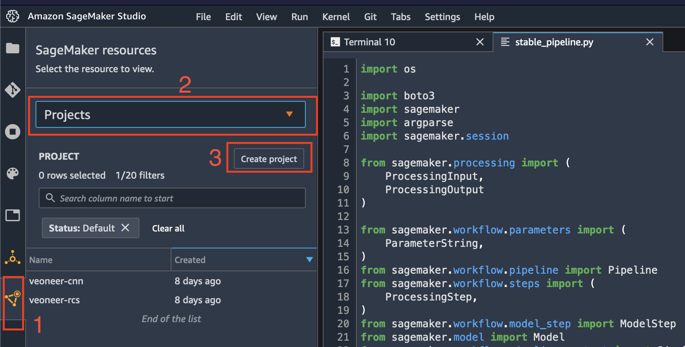
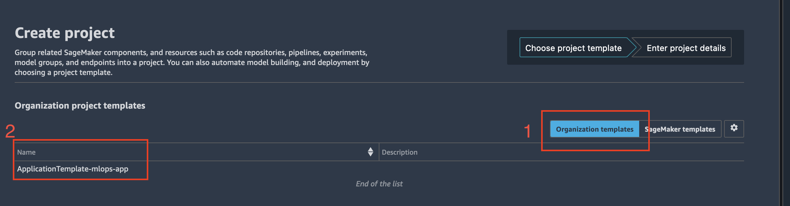
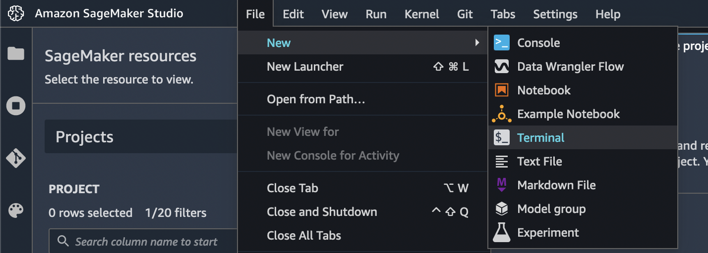
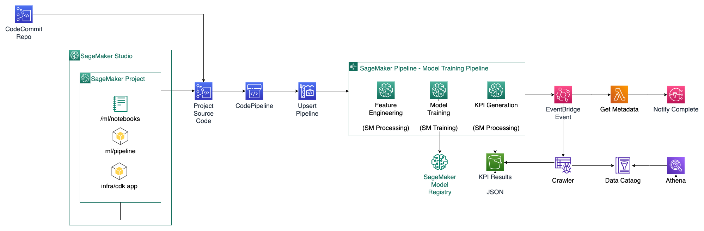

## Sample Use Case

This project contains a sample MLOPS solution including infrastructure as code and sample notebooks and sagemaker pipeline.

## Deployment

To deploy your new use case, follow the steps:

1. Open SageMaker Studio.
2. Start new SageMaker project from project template (if you are seeing this, most likely this has been done). To do this:

   - In the Studio sidebar, choose the SageMaker resources icon
   - select `Projects`
   - Choose `Create project`
     
   - Select `Organization templates`
   - Select `ApplicationTemplate-mlops-app`
     

   - Follow the instructions, and after project is created clone the repository

3. Open terminal
   
4. Using terminal command `cd` go to the repository that you cloned in the step before
5. Run `sh boostrap.sh` and enter the data when the prompt asks you
6. Run `sh deploy.sh`. At some point, the script will print out number of resources to deploy and ask for confirmation. Confirm by entering `y`
   From that point onwards, all the changes to SageMaker stable pipeline inside repository main branch will be automatically deployed.
7. Optional: Subscribe to SNS topic prefixed with your project name (i.e. `veoneer-<usecase_id>-sns` is the topic for project `veoneer-<usecase_id>`) to get notified when model has been approved.

### Project Structure

```
├── bootstrap.sh   <--- Run on first Init
├── buildspec.yaml <--- CICD Build Specification
├── deploy.sh      <--- Deploy infrastructure as Code
├── infra          <--- Infrastructure as Code (CDK) App
│   ├── app.py     <--- CDK App
│   ├── pipeline.py
│   ├── source-activate-venv <--- Activate Node & Python virtual envs
└── ml              <--- Machine Learning Code
    ├── requirements.txt
    ├── run_experimental_pipeline.ipynb <-- Exp pipeline
    ├── run_stable_pipeline.ipynb       <-- Stable pipeline
    ├── scripts                 <-- Scripts for pipeline steps
    │   ├── __init__.py
    │   ├── evaluate.py
    │   └── preprocess.py
    └── stable_pipeline.py      <-- Stable pipeline code
```

### ML directory

ML directory contains all relevant code for machine learning. By default, there 2 different pipelines, for 2 different workflows:

- _experimental pipeline_: This is the SageMaker pipeline for trying new things. The pipeline name will be the name entered in bootstrapping script + `experimental`. This pipeline can be created and modified in run_experimental_pipeline.ipynb.
- _stable pipeline_: Stable pipeline the pipeline used for delivery of models, is version controlled (in codecommit) and automatically updated by pipeline. The definition of the pipeline is inside `stable_pipeline.py`, inside the function `get_pipeline`. To update the pipeline, change it directly there.
  After the updated file has been committed and pushed to repository main branch, codepipeline (not SageMaker pipeline) will automatically update SageMaker pipeline. The name of the pipeline will be the name from bootstrapping script + `stable`. You can see how the `stable_pipeline.py` is executed by inspecting `buildspec.yaml`, which is set of instructions used in codepipeline.
  Alternatively, the pipeline can be updated and run in the notebook `run_stable_pipeline.ipynb`.
  _Important_: please ensure that `requirements.txt` contains all dependencies that are needed to run `stable_pipeline.py`.

### Infra

Infra folder contains CDK (Cloud Development Kit) code in Python for the infrastructure of following items:

- _notification stack_ - responsible for sending notification when new model has been _approved_. By default, models are in `pending approval` state. _Important_: model registry has to follow the name `{pipeline name from bootstrap script}-stable-models` for the notifications to be sent
- _kpi_visualisation stack_ - responsible for querying and visualization of data contained in the output CSV files using Athena and QuickSight, respectively
- _codepipeline infrastructure_ - responsible for deployment of above stacks and updating SageMaker pipeline

The `app.py` in the entry point, which imports required stacks and sets up parameters and creates the application. For more information, see the `infra/README.md`

### ML directory

ML directory contains all relevant code for machine learning. By default, there 2 different pipelines, for 2 different workflows:

- _experimental pipeline_: This is the SageMaker pipeline for trying new things. The pipeline name will be the name entered in bootstrapping script + `experimental`. This pipeline can be created and modified in run_experimental_pipeline.ipynb.
- _stable pipeline_: Stable pipeline the pipeline used for delivery of models, is version controlled (in codecommit) and automatically updated by pipeline. The definition of the pipeline is inside `stable_pipeline.py`, inside the function `get_pipeline`. To update the pipeline, change it directly there.
  After the updated file has been committed and pushed to repository main branch, codepipeline (not SageMaker pipeline) will automatically update SageMaker pipeline. The name of the pipeline will be the name from bootstrapping script + `stable`. You can see how the `stable_pipeline.py` is executed by inspecting `buildspec.yaml`, which is set of instructions used in codepipeline.
  Alternatively, the pipeline can be updated and run in the notebook `run_stable_pipeline.ipynb`.
  _Important_: please ensure that `requirements.txt` contains all dependencies that are needed to run `stable_pipeline.py`.

### Infra

Infra folder contains CDK (Cloud Development Kit) code in Python for the infrastructure of following items:

- _notification stack_ - responsible for sending notification when new model has been _approved_. By default, models are in `pending approval` state. _Important_: model registry has to follow the name `{pipeline name from bootstrap script}-stable-models` for the notifications to be sent
- _kpi_visualisation stack_ - responsible for querying and visualization of data contained in the output CSV files using Athena and QuickSight, respectively
- _codepipeline infrastructure_ - responsible for deployment of above stacks and updating SageMaker pipeline

The `app.py` in the entry point, which imports required stacks and sets up parameters and creates the application. For more information, see the `infra/README.md`

### Basic Architecture


