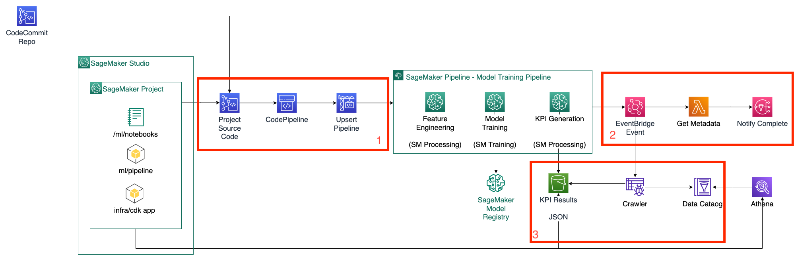

# SageMaker Project Infrastructure

This folder contains the infrastructure as code components for your ML project. It includes the configuration to deploy:

- CICD Pipeline for updating SageMaker Pipeline (running `python stable_pipeline.py`)
- Self mutating CICD Pipeline for Deploying infrastructure defined in this project
- Infrastructure for KPI -> QuickSight Data Source Generation
- Infrastructure for Notifications when a new model has been trained

For more info, see the stack specific documentation below.

# Using CDK

This project is set up like a standard Python project. The initialization
process also creates a virtualenv within this project, stored under the `.venv`
directory. To create the virtualenv it assumes that there is a `python3`
(or `python` for Windows) executable in your path with access to the `venv`
package. If for any reason the automatic creation of the virtualenv fails,
you can create the virtualenv manually.

You can activate the auto-created (by bootstrap.sh) venv and nvm config (Activates the correct node and python versions)
```
$ source source-activate-venv
```

Alternatively: 

To manually create a virtualenv on MacOS and Linux:

```
$ python3 -m venv .venv
```

After the init process completes and the virtualenv is created, you can use the following
step to activate your virtualenv.

```
$ source .venv/bin/activate
```

Once the virtualenv is activated, you can install the required dependencies.

```
$ pip install -r requirements.txt
```

At this point you can now synthesize the CloudFormation template for this code.

```
$ cdk synth
```

To add additional dependencies, for example other CDK libraries, just add
them to your `setup.py` file and rerun the `pip install -r requirements.txt`
command.

## Useful commands

- `cdk ls` list all stacks in the app
- `cdk synth` emits the synthesized CloudFormation template
- `cdk deploy` deploy this stack to your default AWS account/region
- `cdk diff` compare deployed stack with current state
- `cdk docs` open CDK documentation

# Resources deployed by app

There are different sets of resources deployed by the application:

1. _codepipeline infrastructure_ - responsible for deployment of above stacks and updating SageMaker pipeline
2. _notification stack_ - responsible for sending notification when new model has been _approved_ By default, models are in `pending approval` state.
3. _kpi_visualisation stack_ - responsible for querying and visualization of data contained in the output CSV files using Athena and QuickSight, respectively.
   

## Codepipeline infrastructure

The codepipeline infrastructure is the infrastructure that deploys the Notifications and KPI visualisations infrastructure. The source code for the Pipeline stack is at `infra/pipeline.py`. It create Pipeline stack, which consists of:

- Stages, one for notifications and one for kpi visualisations
- IAM roles for the execution of the stages
- Source, which defines where the source the code from
  _Note_: Notifications stage has a post step - step run at the end of the notifications stage. This step runs the buildspec.yaml file, which upserts (updates if exists, inserts of does not exist) the SageMaker pipeline.

## Notifications

To find the source code for the _notifications stack_ see `infra/notifications/notifications_stack.py`.
It creates

- Event bridge rule, that listens for new model in SageMaker model registry for the model with the name: `{pipeline name from bootstrap script}-stable-models`
- Lambda that will be triggered by the event. The source code for lambda can be found at `infra/lambda/get_model_metadata/lambda.py`. When triggered, it checks if model status is approved, prepares message for SNS topic and sends it.

## KPI visualisations

The resources deployed as part of the KPI visualisations stack can be found in `infra/notifications/kpi_visualization_stack.py`.

Once deployed, the stack creates

- A Glue Crawler, which crawls the metadata regarding output CSV files
- An Athena Workgroup which separates queries from other queries within the same account
- A QuickSight data source that can be used to access the data in CSV files from within the service to subsequently create analyses and dashboards. This data source is visible to users whose ARNs are mentioned in the `cdk.json` file under the key `quicksight_principal_user_arns`.

The stack also creates any required roles and adds policies to existing roles where needed.

### Forming a Principal User ARN

A Principal User ARN looks like the following

```
arn:aws:quicksight:us-east-1:<AccountID>:user/default/<Username>
```

where `<AccountID>` is the placeholder for the AWS Account ID and `<Username>` is the placeholder for a valid QuickSight username in the account. To get the QuickSight username for your user, refer to their corresponding value in the Username column illustrated [here](https://docs.aws.amazon.com/quicksight/latest/user/managing-users.html).

**WARNING:** If `quicksight_principal_user_arns` list is empty, the DataSource creation for the stack would be skipped.

## App

`app.py` is the entrypoint for CDK. That is how CDK determines what to deploy. You can see that code inside `app.py` sets up variables for the infrastructure (i.e. reads from `.sagemaker-code-config`). Inside, it has only one stack - `PipelineStack`. The reason for this is that other stacks are parts of the Pipeline stack.
