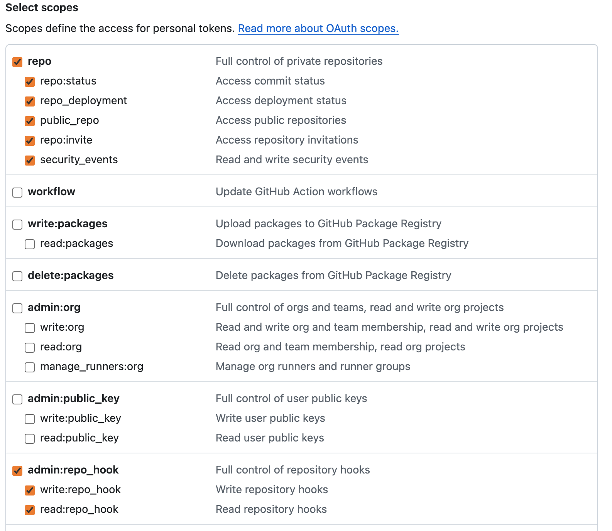
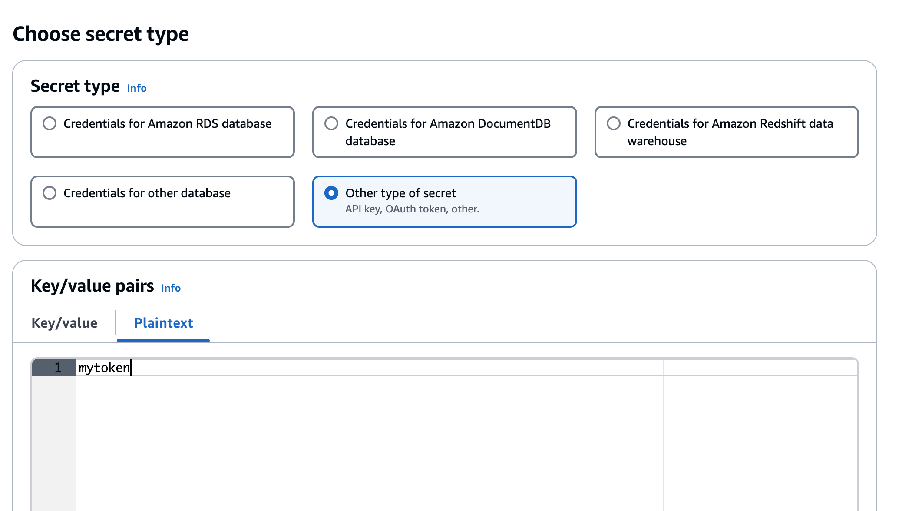
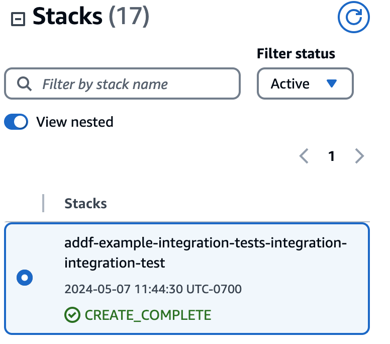

# Integration Tests Module

## Description

This module creates infrastructure to run integration tests of various `seed-farmer` manifest(s) that are managed in a repository. Specifically, an AWS CodePipeline is provisioned that runs `seedfarmer apply` & `seedfarmer destroy` in sequence for any one or multiple manifests that are passed to the module. The pipeline is connected to a Github repository via an OAuth Token.

## Usage 
### Prerequisites
1. Github Personal Access Token with the following permissions to your private repository. 
2. Store Token in Secrets Manager with type `Plaintext`. 
3. Reference Secret Value in Module Manifest: e.g.
```yaml
---
name: integration-test
path: modules/testing/integration-tests
targetAccount: integ
parameters:
  - name: manifest-paths
    value: manifests/example-integration-tests/deployment.yaml
  - name: repo-owner
    value: my-github-org-name
  - name: repo-name
    value: my-repo-name
  - name: oauth-token-secret-name
    value: my-oauth-token
```

### Deployment
It is recommended that you do not deploy your integration test module in the same region/account you deploy the rest of your modules to. Use a different target region and/or account to avoid resource conflicts during invocations of the integration tests pipeline.

**Account mapping alias must be one of `["integ","integration","integ-tests", "integration-tests",]` for the integration test to work properly**

[Example deployment manifest using an alias for integration tests region](../../../manifests/example-integration-tests/deployment.yaml):

```yaml
name: example-integration-tests
toolchainRegion: us-west-2
forceDependencyRedeploy: True
groups:
  - name: optionals
    path: manifests/example-integration-tests/optional-modules.yaml
  - name: integration
    path: manifests/example-integration-tests/integration-test.yaml
targetAccountMappings:
  - alias: primary
    accountId: 123456789101
    default: true
    parametersGlobal:
      dockerCredentialsSecret: aws-addf-docker-credentials
    regionMappings:
      - region: us-west-2
        default: true
  - alias: integ
    accountId: 123456789012
    regionMappings:
      - region: us-east-1
        default: true
```

[Example module manifest using alias](../../../manifests/example-integration-tests/integration-test.yaml):

```yaml
---
name: integration-test
path: modules/testing/integration-tests
targetAccount: integ
parameters:
  - name: manifest-paths
    value: manifests/example-integration-tests/deployment.yaml
  - name: repo-owner
    value: awslabs
  - name: repo-name
    value: autonomous-driving-data-framework
  - name: oauth-token-secret-name
    value: my-oauth-token
```

1. Bootstrap account. 
```bash
seedfarmer bootstrap toolchain --project addf --trusted-principal ${ROLE_ARN} --region ${AWS_REGION} --as-target
```

2. Deploy Manifest
```bash
seedfarmer apply manifests/example-integration-tests/deployment.yaml
```

3. Once the stack is deployed... 
push code to the repo and branch specified in your module to start the integration test.


## Inputs/Outputs

### Input Parameters

#### Required
- `manifest-paths`: Local paths within your github repo to desired manifest(s) to test. If specifying multiple please use comma-separated values. (e.g. `"manifests/this/deployment.yaml,manifests/that/deployment.yaml"`)
- `repo-owner`: Github Organization or Owner name of repository.
- `repo-name`: Github Repository Name.
- `oauth-token-secret-name`: Name of the SecretsManager secret that stores your github personal access token value.

#### Optional
- `branch`: Repository branch to connect to integration tests. Defaults to `main`.

### Module Metadata Outputs

- `${SEEDFARMER_PROJECT_NAME}IntegrationTestPipeline`: Integration testing pipeline name.
- `${SEEDFARMER_PROJECT_NAME}IntegrationTestAlertsTopic`: Name of SNS topic setup to receive Alerts from CodePipeline via CodeStar Notifiations.

#### Output Example

```json
{
  "ADDFIntegrationTestPipeline": "addf-prod-integration-tests-Pipeline",
  "ADDFIntegrationTestAlertsTopic": "addf-prod-integration-tests-AlertsTopic",
}

```